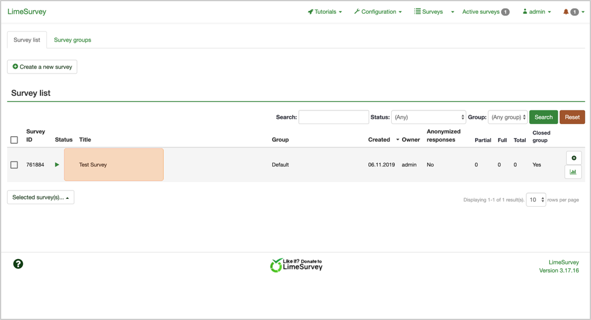
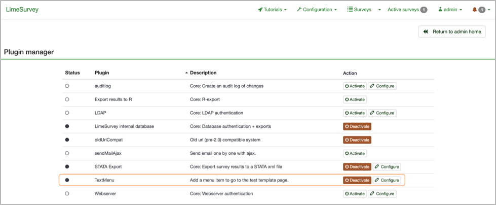

# Send SMS Invitations  
This plugin allows Limesurvey users to send surveys via SMS text message.

## Table of Contents  
<ul>
  <li><a href="#pluginConfig">Plugin Activation</a></li>
  <li><a href="#getStarted">Go to survey</a></li>
  <li><a href="#addPartAttri">Adding participant attributes</a></li>
  <li><a href="#addPartManually">Adding participants manually</a></li>
  <li><a href="#addPartCSV">Adding participants via CSV</a></li>
  <li><a href="#sendSurvey">Sending out surveys</a></li>
  <li><a href="#troubleshooting">Troubleshooting</a></li>
</ul>

<h2 id="#pluginConfig">Plugin Activation</h2>
Plugin Activation
Now we need to activate the plugin. 

Step 1: From the home screen, click on the `Configuration` button in the top navigation bar. 


Step 2: Under `Settings`, click on `Plugin manager`. 


Step 3: The plugin is called TextMenu. After you find it in the list, click on `Configure`. 


Step 4: On the Settings screen, you will see 3 fields: Twilio Account SID, Twilio Authentication Token, and Twilio Phone Number. Put in the 3 corresponding numbers you copied earlier. For the Server URL field, copy the URL from your address bar from the beginning up to and including `/index.php`. Click “Save and Close”. 


Step 5: Upon returning to the Plugin Manager screen, locate the TextMenu plugin again and click “Activate”. 


Congratulations! The plugin is now activated. 

<h2 id="getStarted">Go to survey</h2>
To get started, click the `Surveys` button in the top navigation bar or the `List surveys` button in the main center menu.  
  

From this page, choose your survey.   
   

<h2 id="addPartAttri">Adding participant attributes</h2> 
The TextMenu plugin requires a special attribute in Limesurvey in order to send text messages. This attribute is where we will enter participants’ phone numbers.    

Step 1: Click on ```Survey participants``` in the side bar or in the top bar.  
   

Step 2: Click on the ```Manage attributes``` button at the top.   
   

Step 3: Under “Add/delete survey participant attributes,” add 1 attribute by verifying the “Number of attribute fields to add” is 1 and by clicking on the ```Add fields``` button.   
    

Step 4: You will see a notification that “1 field(s) were successfully added,” and you will see a field “attribute_1” in the list of attribute fields. Under “Field description, type in “phone_number”.    
    

Step 5: Click the toggle button under “Mandatory” so that it reads “On”.   
   

Step 6: Under “Field caption”, type in “Phone Number”. Click the ```Save``` button when complete.   
   

Congratulations! You have successfully set up the required attribute to be able to send surveys via SMS text message. You can see this phone number attribute under ```Survey Participants```.    
   

<h2 id="addPartManually">Adding participants manually</h2> 
There are 2 ways to add participants: manually or via a CSV file. We’ll go over adding participants manually first.      

Step 1: Navigate to the ```Survey participants``` screen.   
   

Step 2: Click on ```Create``` on the top. Click on ```Add participant``` in the drop-down menu.   
   

Step 3: On the “Add survey participant” screen, fill in the relevant fields. Once complete, click on the ```Additional attributes``` tab at the top.   
   

Step 4: In the “phone_number” field, enter in your participant’s phone number. **It must begin with a +, followed by the country code, followed by the phone number, with no symbols or spaces. (The country code for the US is 1).** Once complete, click the green ```Save``` button in the top right.    
   

Step 5: After you see the Success message, navigate back to the ```Survey participants``` page.   
   

Step 6: As a final step, we need to generate tokens so that Limesurvey can identify each participant. From the ```Survey participants``` page, click the ```Generate tokens``` button in the top. Click ```Yes``` when prompted to create tokens.    
   

Congratulations! You have just added your first participant manually.    

<h2 id="addPartCSV">Adding participants via CSV</h2>   
If you want to avoid adding participants one-by-one, you can upload a CSV with participant information instead.      

Step 1: Navigate to the ```Survey participants``` screen.   
   

Step 2: Click on the ```Create``` button on the top. In the drop-down menu, click on Import participants from: “CSV file”.    
   

Step 3: Click the ```Choose File``` button to choose a CSV file to upload. (Make sure that the requirements listed at the bottom of the page are met before uploading. **Phone numbers need to begin with a +, the country code, followed by the number with no symbols or spaces).**   
   

Step 4: Click the ```Upload``` button at the bottom of the page.   
   

Step 5: As a final step, we need to generate tokens so that Limesurvey can identify each participant. From the ```Survey participants``` page, click the ```Generate tokens``` button in the top. Click ```Yes``` when prompted to create tokens.    
   

Congratulations! You have just added participants via a CSV file.    

<h2 id="sendSurvey">Sending out surveys</h2>   
Now we can finally send out surveys via text message!      

Step 1: Click on the ```Send text invitations``` in the side navigation bar.    
   

Step 2: On the “Send text invitations” page, you should see the participants you have created or uploaded. Check the participants you would like to send surveys to via text message.    
   

Step 3: You can now customize the message that participants will see. Remember, this is the text message that your participants will receive to complete your survey. **Do not alter any text inside the curly brackets { }.**    
   

Step 4: Once you are satisfied with your outgoing text message, click on the ```Send via Text``` button to send your survey to your selected participants via text message.    
   

Congratulations! You have now sent your survey via text message.   
   

<h2 id="troubleshooting">Troubleshooting</h2>   
If any errors occur, complete the following steps:      

Step 1: Check to make sure all phone numbers of participants begin with a +, followed by the country code, followed by the rest of the phone number with no other symbols or spaces.    

Step 2: Check in Configuration and make sure that the attribute number is correct.    
   
   
   
